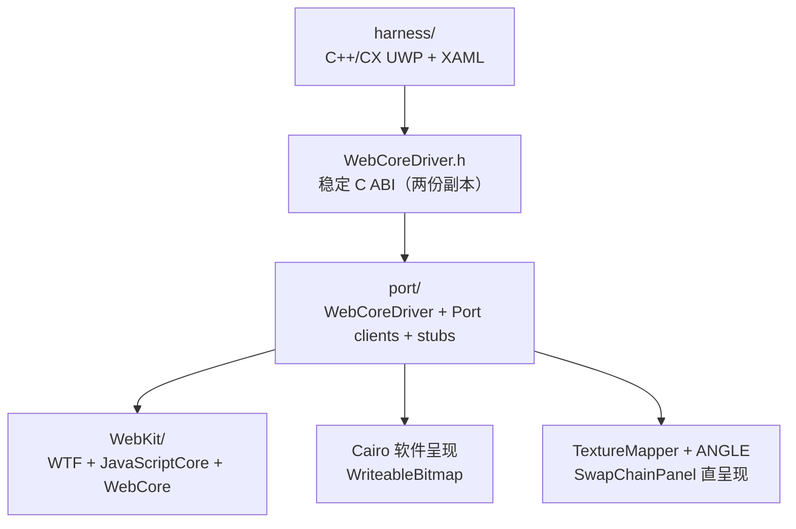

# Project Apotheosis

## 项目定位

Apotheosis（EdgeHTML Reborn）是在 Windows 10 Mobile ARM32/UWP 上运行现代 WebKit/WebCore 的浏览器引擎移植项目。目标设备是 Lumia 950/950 XL 等 Windows 10 Mobile 手机；上游引擎基线为 `webkitgtk-2.52.4`。

仓库只维护移植层、UWP 宿主和部署工具。上游 `WebKit/`、构建目录、第三方预编译库和字体不属于仓库的可审查源码，必须按本机环境重新准备。

## 当前基线（2026-07-25）

- 当前分支：`gpu-path1`，开发配置：`build-clang-gpu`。
- App manifest 版本：`0.1.8.11`，目标系统：Windows 10 Mobile `14393+`，ARM32。
- 引擎：WebCore 页面会话、HTML/CSS 布局、网络加载、真实点击/滚动/输入、页内查找、JavaScriptCore JIT。
- 软件呈现：Cairo → RGBA → UWP `WriteableBitmap`，作为通用回退路径。
- GPU 呈现：ANGLE（D3D11 FL9_3）+ TextureMapper → `SwapChainPanel`；只有 `WebCoreGpuInit` 成功后才启用，失败时继续走软件路径。
- 宿主 UI：地址栏、标签页、历史/书签/下载、设置、页内查找、触摸滚动、捏合缩放、中英语言选择、移动/桌面/自定义 UA、更新检查和诊断导出。
- 内存与持久化：UWP 内存压力回调触发 WebCore 释放；Cookie、历史、书签、下载和设置写入应用 `LocalState`。Cookie 旁路快照的读写结果记录在 `cookies.jsonl.diag`，供 Device Portal 拉取诊断。

本机证据：最近记录的 GPU 驱动链接成功，ARM appx 构建成功；已有真机记录证明 ANGLE/SwapChainPanel 探针可初始化并渲染。但 `gpu-verify-result.txt` 记录的是旧版 `0.1.7.6` 的崩溃，不能作为 `0.1.8.11` 当前版本的通过结论。改动后的最终判断必须重新部署到 Lumia 真机。

## 架构



三套构建角色不能混用：

| 层 | 工具链 | 产物/用途 |
|---|---|---|
| WTF/JSC/WebCore | clang-cl，`thumbv7-unknown-windows-msvc` | WebKit ARM32 引擎 |
| `port/*.cpp` | clang-cl + lld-link | `WebCoreDriver-gpu.dll/.lib` |
| `harness/` XAML codegen | VS2017 MSBuild + v141 ARM + SDK 17763 | 官方 C++/CX XAML `.g.*`、XBF、类型元数据 |
| `harness/` final build | VS18 MSBuild + MSVC v143 ARM，工具集 14.44.35207 + SDK 22621 | 编译宿主和官方 XAML 产物，链接 WebKit，打包 UWP ARM appx |

## 目录职责

- `port/`：引擎驱动、`ChromeClient`/`FrameLoaderClient`、平台策略、符号 stub、ARM32 环境和构建/链接脚本。
- `harness/`：C++/CX UWP 浏览器宿主、XAML UI、C ABI 头文件副本和 appx 清单。
- `tools/`：Device Portal 部署、重试部署、启动、崩溃/截图诊断。
- `angle/include/`：跟踪的 ANGLE 头文件；ARM 二进制库在本地准备且被忽略。
- `WebKit/`：本地 sparse 的上游源码，不纳入本仓库审查；ARM/App-Container 改动必须使用 `WK_WINUWP` 守卫并带 `Apotheosis:` 注释。

核心入口：

- `port/WebCoreDriver.cpp`：常驻 `Page`/`Frame` 会话、加载、事件、软/GPU 呈现、诊断和 C ABI 实现。
- `port/PortChromeClient.*`：GPU 合成开关、根 `GraphicsLayer` 捕获和呈现更新通知。
- `port/LoadingFrameLoaderClient.*`：网络加载策略回调。
- `harness/MainPage.xaml.cpp`：引擎线程调度、UI 交互、软件/GPU 呈现切换和浏览器功能。
- `port/build-harness.ps1`：默认使用 VS2017 的官方 C++/CX XAML 编译器生成 `.g.*`/XBF，再由 VS18/v143 构建最终 appx；`-XamlMode Fallback` 可切回 `XamlReader` fallback。
- `docs/HARNESS-BUILD.md`：harness 双 VS 工具链、依赖、构建参数、部署和故障排查的维护手册。

## 不可破坏的约束

1. 路径必须保持 ASCII：仓库默认 `E:\Apotheosis`，vcpkg 默认 `C:\vcpkg`。Ruby/meson 代码生成器对非 ASCII 路径不可靠。
2. C++ 异常关闭：引擎/驱动使用 `_HAS_EXCEPTIONS=0` 和 `/EHs-c-`。
3. 引擎线程单线程化：所有 C ABI 引擎调用串行投递到同一个引擎线程；UI 线程不得同步等待引擎。
4. `present` 只能发生在引擎线程。ANGLE 的窗口创建/调整大小可能回调 UI dispatcher，不能构造相互等待。
5. 软件呈现是安全底座；GPU 必须由 `g_gpuActive` 严格门控，GPU 初始化失败不可影响 Cairo 回退。
6. `port/WebCoreDriver.h` 与 `harness/WebCoreDriver.h` 必须同步修改，否则会产生静默 ABI 不一致。
7. 上游 WebKit 改动必须置于 `#if defined(WK_WINUWP)` 守卫内，并留下 `Apotheosis:` 说明。

## 构建与验证

以下命令在 PowerShell 7、`E:\Apotheosis` 中执行。

```powershell
# 首次配置 GPU + JIT 引擎
pwsh -File E:\Apotheosis\port\configure-gpu.ps1

# 改动 WebKit 源码后：增量编译引擎，再重链驱动
. E:\Apotheosis\port\arm32-uwp-env.ps1
& "C:\Program Files\Microsoft Visual Studio\18\Community\Common7\IDE\CommonExtensions\Microsoft\CMake\Ninja\ninja.exe" -C E:\Apotheosis\build-clang-gpu WebCore
pwsh -File E:\Apotheosis\port\link-driver-gpu.ps1

# 只改 port/*.cpp 时：重链驱动即可；单文件快速检查
pwsh -File E:\Apotheosis\port\compile-driver-gpu.ps1 E:\Apotheosis\port\WebCoreDriver.cpp E:\Apotheosis\port\WebCoreDriver.gpu.obj
pwsh -File E:\Apotheosis\port\link-driver-gpu.ps1

# 默认：VS2017 官方 C++/CX XAML codegen + VS18/v143 最终编译、链接和打包
pwsh -File E:\Apotheosis\port\build-harness.ps1

# 清理后验证完整链路
pwsh -File E:\Apotheosis\port\build-harness.ps1 -Clean

# 应急：跳过官方 XAML codegen，使用现有 XamlReader fallback
pwsh -File E:\Apotheosis\port\build-harness.ps1 -XamlMode Fallback

# 真机部署；设备需启用 Device Portal 并与构建机同网
pwsh -File E:\Apotheosis\tools\deploy-launch.ps1 -Ip <device-ip> -Ver 0.1.8.11
```

构建机是 x64，ARM32 appx 不能在本机运行；功能验证唯一可信的运行环境是 Lumia 真机。设备掉 Wi-Fi 时使用 `tools\Deploy-Robust.ps1`。发布前要同步升高 `harness\Package.appxmanifest` 的 `Version` 和部署参数。

## 当前工作树交接

交接时工作树不是干净状态，已有用户改动集中在：

- `harness/`：App、MainPage、XAML 工程、manifest、生成代码和 ABI 头。
- `port/`：网络存储、WebCoreDriver、GPU 编译辅助脚本。
- 未跟踪：`.reasonix/`、`port/_link-only.ps1`。

接手时先运行 `git status --short --branch`，逐项确认这些改动的归属；不要 reset、checkout 或清理未确认的文件。构建日志和 `.obj/.lib/.dll` 等实验产物不应被当作源码事实。

## 维护入口

本文件是项目现状与架构的唯一概述。`AGENTS.md` 和 `CLAUDE.md` 只承载代理/开发工作规则；法律信息见 `LICENSE` 与 `NOTICE`。阶段交接、旧里程碑记录和媒体计划已移除，避免新接手者误读历史状态。

构建 harness 前或遇到 XAML/链接错误时，先读 `docs/HARNESS-BUILD.md`。
